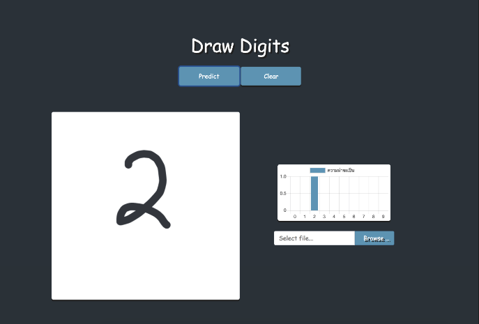

# Drawing App

A Computer programming project (2017).

# Installation

1. Install python3 & node.js
2. Install all require package python (with `pip install -r requirements.txt` in directory file)
3. Install module node.js (with `npm i` in directory file)

# How to run

1. Running server (with `sh run.sh` in terminal in directory file)
2. Open browser URL http://localhost:8080
3. Good luck have fun!

# Reference

* Digit dection: https://github.com/penny4860/SVHN-deep-digit-detector
* Drawing and KerasJS: https://github.com/transcranial/keras-js

